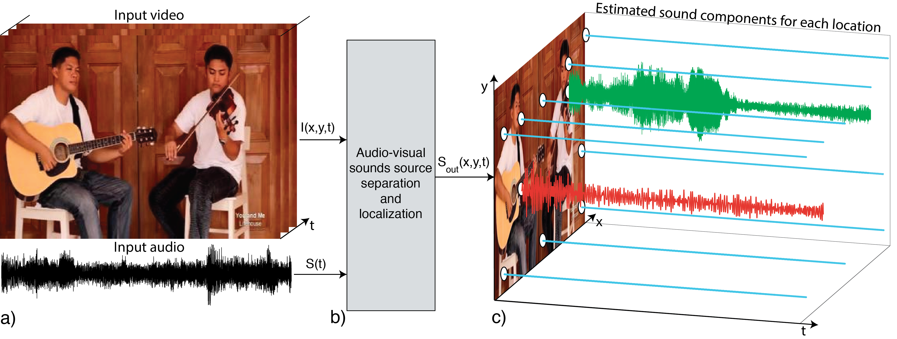

We create a model which trains on unlabeled videos and learns to locate and cluster image regions which generate sound via observing motion in those pixels. Our model gives as output the input sound separated into components corresponding to each sound-producing region in the video. Our model uses the basic reason as to how sound is generated, which is motion. We utilize this natural link between visual and auditory perception to create models which will jointly parse the sound and the images of objects creating those sounds, without requiring any labelling or annotation or manual supervision. 
Our model is supposed to learn the visual-audio correspondence just like we humans can detect which sound is emitted from where by observing motion of objects. We will be able to obtain individual speeches and thus manipulate them as needed.
Further, we have used Adaptive Noise Cancellation techniques with filters like LMS and RLS to try and  enhance the results of the model obtained.



## Environment
The code is developed under the following configurations.
- Hardware: 1-4 GPUs (change ```[--num_gpus NUM_GPUS]``` accordingly)
- Software: Ubuntu 16.04.3 LTS, ***CUDA>=8.0, Python>=3.5, PyTorch>=0.4.0***

## Training
1. Prepare video dataset.

    a. Download MUSIC dataset from: https://github.com/roudimit/MUSIC_dataset
    
    b. Download videos.

2. Preprocess videos. You can do it in your own way as long as the index files are similar.

    a. Extract frames at 8fps and waveforms at 11025Hz from videos. We have following directory structure:
    ```
    data
    ├── audio
    |   ├── acoustic_guitar
    │   |   ├── M3dekVSwNjY.mp3
    │   |   ├── ...
    │   ├── trumpet
    │   |   ├── STKXyBGSGyE.mp3
    │   |   ├── ...
    │   ├── ...
    |
    └── frames
    |   ├── acoustic_guitar
    │   |   ├── M3dekVSwNjY.mp4
    │   |   |   ├── 000001.jpg
    │   |   |   ├── ...
    │   |   ├── ...
    │   ├── trumpet
    │   |   ├── STKXyBGSGyE.mp4
    │   |   |   ├── 000001.jpg
    │   |   |   ├── ...
    │   |   ├── ...
    │   ├── ...
    ```

    b. Make training/validation index files by running:
    ```
    python scripts/create_index_files.py
    ```
    It will create index files ```train.csv```/```val.csv``` with the following format:
    ```
    ./data/audio/acoustic_guitar/M3dekVSwNjY.mp3,./data/frames/acoustic_guitar/M3dekVSwNjY.mp4,1580
    ./data/audio/trumpet/STKXyBGSGyE.mp3,./data/frames/trumpet/STKXyBGSGyE.mp4,493
    ```
    For each row, it stores the information: ```AUDIO_PATH,FRAMES_PATH,NUMBER_FRAMES```

3. Train the default model.
```bash
./scripts/train_MUSIC.sh
```

5. During training, visualizations are saved in HTML format under ```ckpt/MODEL_ID/visualization/```.

## Evaluation
0. (Optional) Download our trained model weights for evaluation.
```bash
./scripts/download_trained_model.sh
```

1. Evaluate the trained model performance.
```bash
./scripts/eval_MUSIC.sh
```

Citation:
```bibtex
    @InProceedings{Zhao_2018_ECCV,
        author = {Zhao, Hang and Gan, Chuang and Rouditchenko, Andrew and Vondrick, Carl and McDermott, Josh and Torralba, Antonio},
        title = {The Sound of Pixels},
        booktitle = {The European Conference on Computer Vision (ECCV)},
        month = {September},
        year = {2018}
    }
```
